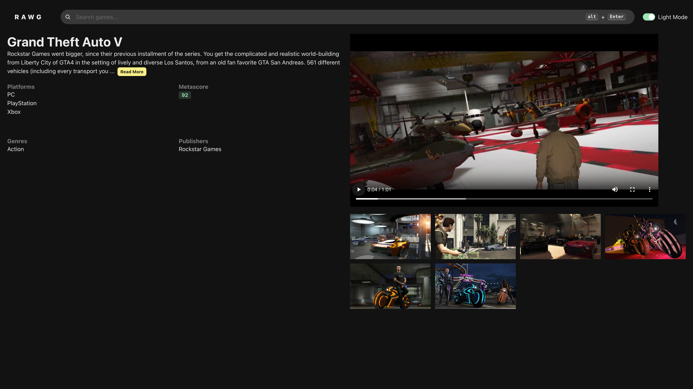

# GameHub

## Introduction

GameHub is a web application designed for gamers to discover new titles, browse trending releases, and explore detailed game information.  
This website was built purely for **educational purposes** and is not intended for production use.

Visit live website – [GameHub](https://game-hub-lyart-psi.vercel.app)

---

## Technologies

This website was built with the following technologies:

- **React (TypeScript)** – Frontend framework
- **React Router** – Client-side routing
- **Zustand** – State management
- **React Query** – Data fetching & caching
- **Chakra Ui** – Styling & responsive design
- **RAWG.io API** – Game data & metadata provider

---

## Goals

- Build a responsive and interactive web application for my portfolio, showcasing front-end development skills.
- Practice consuming and integrating with a third-party REST API.
- Improve state management and caching strategies with tools like Zustand and React Query.
- Deliver a modern, clean UI with Chakra UI
- Gain confidence working with TypeScript in a real project.

---

## Challenges

During development I encountered a number of challenges:

- **Complex state management:** deciding when to use local state, Zustand, or React Query.
- **API integration:** handling loading states, error boundaries, and filtering results from the RAWG.io API.
- **Responsive design:** ensuring the layout looked clean across different devices.
- **Performance optimization:** learning how to avoid unnecessary re-renders and fetch calls.

Through these challenges, I gained hands-on experience with:

- Building reusable React components with TypeScript.
- Managing global state with Zustand in a lightweight way.
- Querying and caching API calls using React Query.
- TailwindCSS utilities for responsive design.
- Best practices for error handling and UX feedback during async requests.

---

## Screenshots

